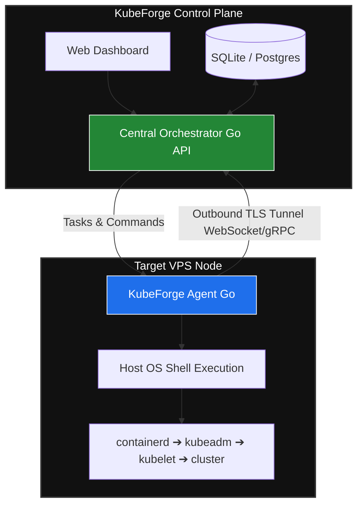

# 🗺️ KubeForge: 7-Day MVP Development Roadmap

This document outlines the accelerated 7-day engineering roadmap to build the core Minimum Viable Product (MVP) for **KubeForge**—an agent-driven, Zero-SSH, "Bring Your Own Infrastructure" (BYOI) Kubernetes platform.

The primary architectural goal of this MVP is to establish an **Outbound Execution Loop**, bypassing the need for inbound SSH or firewall modifications on target nodes.

---

## 🏗️ Core Architecture Overview

---

## 📅 Day-by-Day Implementation Sprint

### 🚀 Day 1: The Outbound Tunnel (Networking Foundation)
* **Goal:** Establish a secure, permanent connection from a firewalled node to the control plane without opening inbound ports.
* **Tasks:**
    - [ ] Create a central **Control Plane server** in Go utilizing an HTTP/WebSocket framework (e.g., Gin, Gorilla WebSocket).
    - [ ] Write a lightweight, compilable **Agent binary** in Go.
    - [ ] Implement an outbound handshake mechanism: the Agent dials out to the Control Plane using a secure WebSocket connection (`wss://`) or gRPC stream.
    - [ ] Generate unique hardware/UUID identifications for each connecting agent.
* **Deliverable:** A running server that logs when an external agent successfully dials home and keeps the connection alive.

### 💻 Day 2: Remote Task Execution & Log Streaming
* **Goal:** Allow the Control Plane to execute shell commands securely on the remote host and watch logs live.
* **Tasks:**
    - [ ] Design a JSON command payload structure format: `{"task_id": "123", "command": "apt-get update"}`.
    - [ ] Implement a JSON command consumer in the Agent that pipes commands directly into the OS shell (`os/exec` in Go).
    - [ ] Implement real-time stdout/stderr log streaming from the Agent back to the Control Plane via the open WebSocket tunnel.
* **Deliverable:** An interactive or programmatic pipeline where typing a command on the server executes it on the VPS, returning output instantaneously.

### 📜 Day 3: Automated Kubernetes Blueprint Scripts
* **Goal:** Script the automated provisioning of raw Linux environments into Kubernetes-ready runtimes.
* **Tasks:**
    - [ ] Write a modular shell script (`bootstrap.sh`) to turn off swap, load necessary kernel modules (`br_netfilter`), and configure sysctl parameters.
    - [ ] Automate the installation of a container runtime (`containerd`) and configure its systemd cgroup driver.
    - [ ] Automate the installation of Kubernetes core tooling components: `kubeadm`, `kubelet`, and `kubectl`.
* **Deliverable:** A single, idempotent bash script that successfully configures a completely clean Ubuntu/Debian instance up to the point of cluster initialization.

### 🗄️ Day 4: State Machine & Database Persistence
* **Goal:** Track cluster configuration, node lifecycles, and command execution states reliably.
* **Tasks:**
    - [ ] Set up an MVP database instance schema (SQLite or PostgreSQL) to store nodes and their registration payloads.
    - [ ] Define an explicit Node Lifecycle State Machine:
        `REGISTERED` ➡️ `PROVISIONING_OS` ➡️ `INSTALLING_K8S` ➡️ `JOINING_CLUSTER` ➡️ `HEALTHY` / `FAILED`
    - [ ] Wire up database updates to trigger based on status reports or execution errors sent back from the agent.
* **Deliverable:** Persisted node data in a database, ensuring that if the control plane restarts, it retains full contextual awareness of every node's installation phase.

### 🕸️ Day 5: Multi-Node Orchestration & Cluster Sync
* **Goal:** Execute coordinated actions across multiple nodes to form a cohesive cluster topology.
* **Tasks:**
    - [ ] Implement logic to designate the first node as the **Control Plane Node** (Master).
    - [ ] Order the Master Agent to run `kubeadm init` along with an overlay network CIDR block specification (e.g., for Flannel or Cilium).
    - [ ] Write a regex parser on the Control Plane to capture the generated `kubeadm join <token> --discovery-token-ca-cert-hash <hash>` line from the Master's output log stream.
    - [ ] Save this token and pass it down as a payload to secondary **Worker Agents** to trigger an automated `kubeadm join`.
* **Deliverable:** A fully automated multi-node orchestration system capable of bootstrapping a master and binding workers together over the network automatically.

### 🎨 Day 6: Control UI Dashboard
* **Goal:** Provide an intuitive graphical interface to monitor node logs and provisioning progress.
* **Tasks:**
    - [ ] Build a sleek UI layout (React, Vue, or Next.js) interacting with the control plane APIs.
    - [ ] Implement a **Node List View** that graphically maps out the active state machine status of all registered nodes.
    - [ ] Create a **Terminal/Logs Modal View** that hooks into the streaming WebSocket data, letting operators watch installations step-by-step.
* **Deliverable:** A clean interface that replaces curl scripts or terminal tracking with single-button visibility.

### 🧪 Day 7: End-to-End Live Multi-Cloud Test
* **Goal:** Verify infrastructure neutrality by provisioning a distributed Kubernetes cluster live.
* **Tasks:**
    - [ ] Spin up two or three raw, completely unmanaged VPS nodes across separate cloud providers (e.g., one on DigitalOcean, one on Hetzner).
    - [ ] Bundle the Agent binary and write a quick setup command line to download and run it via `curl | sh`.
    - [ ] Monitor the web dashboard to ensure the nodes initialize, share tokens, and join together cleanly.
    - [ ] Run `kubectl get nodes` to confirm a multi-node cluster status reads `Ready`.
* **Deliverable:** A functional, multi-cloud Kubernetes cluster bootstrapped via a secure outbound tunnel.

---

## 🛠️ Recommended Technology Stack

| Component | Technology | Reason |
| :--- | :--- | :--- |
| **Agent Binary** | Go (Golang) | Compiles to a single static binary; zero runtime dependencies; perfect for unprovisioned machines. |
| **Control Plane API** | Go / Gin Framework | High-performance networking concurrency; shares core logic structures smoothly with the agent. |
| **Communication Layer**| WebSockets / gRPC | Persistent bi-directional streaming; naturally bypasses strict corporate firewalls. |
| **Database Engine** | SQLite or PostgreSQL | Light footprint for rapid configuration management and state storage. |
| **Frontend UI** | Next.js + TailwindCSS | Fast component rendering; easy to embed clean log streams and terminal components. |

---

## 🔮 Beyond the MVP (Future Milestones)
- [ ] **Cross-Provider Overlay Networking:** Integration of WireGuard or a Cilium mesh tunnel to tie nodes securely across distinct clouds.
- [ ] **Service Catalog:** A built-in marketplace registry parsing Helm charts to enable one-click infrastructure applications (Databases, Ingress, Cert-Manager).
- [ ] **Autonomous Self-Healing:** Monitoring loops where agents detect structural health degradation and re-trigger individual dependency installations autonomously.
